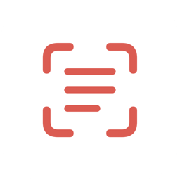

<p align="center">
  
</p>

<h1 align="center">ScreenOCR</h1>

<p align="center">
  A lightweight macOS menu bar app for capturing text and SVG icons from your screen.<br>
  Press <kbd>⌘⇧1</kbd> to OCR any text, <kbd>⌘⇧2</kbd> to grab SVG icons from browsers.<br>
  Results are copied to clipboard instantly.
</p>

---

## Features

**OCR Capture** (<kbd>⌘⇧1</kbd>) — freezes your screen and highlights every word it finds. Select a region or click a word — text is in your clipboard before the overlay closes. Adjacent words on the same line merge into one clean selection.

**SVG Capture** (<kbd>⌘⇧2</kbd>) — extracts real SVG code from any webpage. Click an icon or drag over several — clean vector markup lands in your clipboard, ready to paste into Figma. No browser extensions required.

**Works everywhere** — global hotkeys fire over fullscreen apps, dropdown menus, modals, and popups. The screen freezes the moment you press the shortcut — nothing disappears, nothing closes.

**Switch modes on the fly** — press the other hotkey while the overlay is active to switch between OCR and SVG mode without restarting capture.

**Stays out of your way** — lives in your menu bar. No dock icon, no main window. Two hotkeys, instant results, back to work.

## Supported browsers (SVG mode)

Safari, Chrome, Arc, Brave, Edge, Comet, Vivaldi, Opera, and other Chromium-based browsers.

## Installation

1. Download the latest `.dmg` from [Releases](../../releases)
2. Drag **ScreenOCR.app** to **Applications**
3. Launch and grant the required permissions:
   - **Screen Recording** — for screen capture and OCR
   - **Accessibility** — for global hotkeys
   - **Automation** — for SVG extraction from browsers (prompted on first use)

## Building from source

```bash
git clone https://github.com/halinskiy/ScreenOCR.git
cd ScreenOCR
xcodebuild -scheme ScreenOCR -configuration Release build
```

The built app will be in `~/Library/Developer/Xcode/DerivedData/ScreenOCR-*/Build/Products/Release/`.

## Requirements

- macOS 13.0+
- Xcode 15+ (for building from source)

## Tech stack

Swift, AppKit, Vision framework, CoreGraphics. No SwiftUI, no Storyboards, no external dependencies.

## License

MIT
